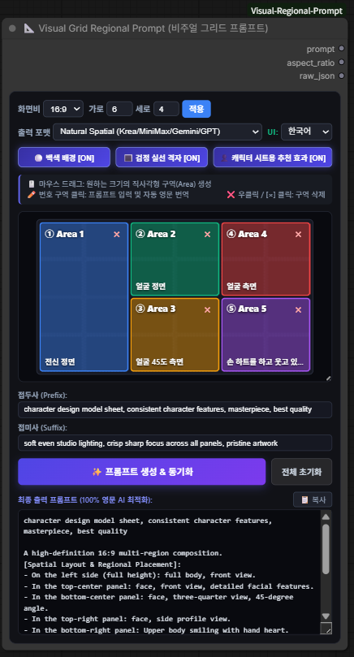
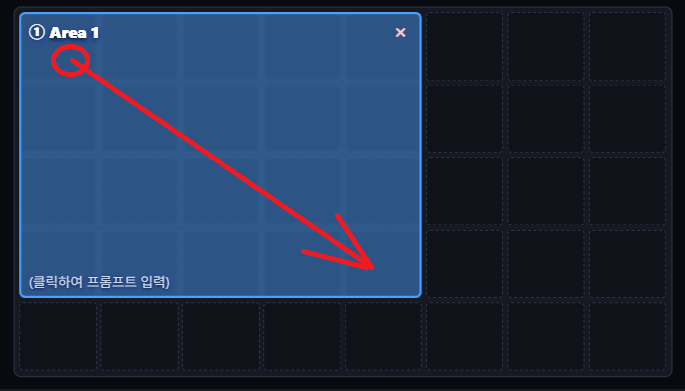
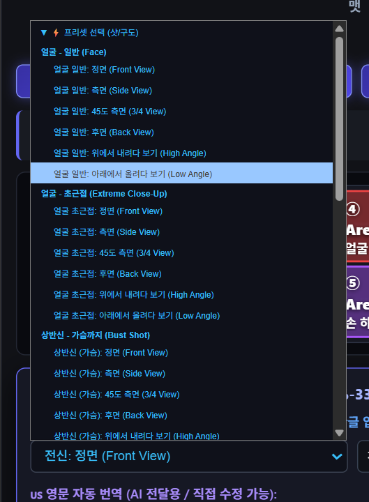

# 📐 ComfyUI Visual Grid Regional Prompt (비주얼 그리드 프롬프트 Pro)

<div align="center">


[](https://github.com/solokjd-eng/Visual-Grid-Prompt-Web)


**ComfyUI 전용 시각적 멀티 패널 공간 구도 프롬프트 생성 커스텀 노드 (Pro 버전)**  
(Krea 2, MiniMax, Flux, SD3, ComfyUI BREAK, Midjourney, Imagen 3, ChatGPT, Gemini 최적화)

[한국어 설명](#-주요-기능) | [Web Standalone 버전 보기](https://github.com/solokjd-eng/Visual-Grid-Prompt-Web)

</div>

---

## 🌟 노드 전체 화면 (Overview)



---

## 📸 핵심 기능 및 사용 가이드 (Visual Guide)

### 1. 🖱️ 마우스 클릭 & 드래그 영역 분할
* 빈 격자 칸에서 **마우스 좌클릭 후 대각선으로 드래그하고 손을 놓으면**, 지정한 크기의 사각형 영역(Area)이 즉시 생성됩니다.
* 각 영역마다 번호와 고유 네온 컬러가 부여되어 복잡한 다분할 구도도 한눈에 직관적으로 파악할 수 있습니다.



---

### 2. 📂 윈도우 탐색기형 샷/구도 트리 셀렉터 (10대 캐릭터 시트 분류)
* 평소에는 대분류 폴더만 깔끔하게 보이다가 클릭 시 윈도우 탐색기처럼 하위 소분류가 부드럽게 펼쳐집니다.
* **캐릭터 시트 특화 10대 핵심 분류**:
  1. **👤 얼굴 (헤어부터 쇄골까지)**: 정면, 측면, 45도 측면, 위에서 본(하이앵글), 아래에서 본(로우앵글), 후면(뒷머리)
  2. **👁️ 얼굴 초근접 (Extreme Macro Close-up)**: 정면, 측면, 45도 측면
  3. **👚 상반신 가슴까지 (Bust Shot)**: 정면, 측면, 45도 측면, 위에서 본, 아래에서 본
  4. **👗 상반신 허리까지 (Waist Shot)**: 정면, 측면, 45도 측면, 위에서 본, 아래에서 본
  5. **✨ 가슴 클로즈업 (Chest & Neckline)**: 정면, 측면, 45도 측면, 위에서 본, 아래에서 본
  6. **🧍 전신 (Full Body Turnaround)**: 정면, 측면, 45도 측면, 후면(뒷모습 전신), 자연스러운 워킹 포즈
  7. **🦵 하반신 (엉덩이부터 다리/각선미)**: 정면, 측면, 45도 측면, 후면, 매혹적인 포즈
  8. **🍑 엉덩이부 (Hips & Buttocks)**: 골반 정면, 엉덩이 측면, 엉덩이 후면(뒷태), 아래에서 본
  9. **🖐️ 손 클로즈업 (Hands & Fingers)**: 손등, 손바닥
  10. **🦶 발 클로즈업 (Feet & Toes)**: 발등(맨발), 발바닥, 발 정면, 발 45도 측면, 발 측면
* **실시간 검색 지원**: 상단 검색창에 `쇄골`, `발등`, `워킹`, `누운` 등을 입력하면 즉시 필터링됩니다.



---

### 3. ⚡ 1:1 구도 교체 (Replace) 시스템
* 프리셋이나 구도를 변경할 때 이전 프롬프트 뒤에 쉼표로 계속 누적되지 않고, **선택한 새 구도로 캔버스 실루엣과 텍스트가 깨끗하게 1:1 즉시 교체**됩니다.

---

### 4. ⭐ 나만의 프리셋 (커스텀) 전용 드롭다운 & 관리 서랍
* **독립 2단 셀렉트**: 기본 프리셋과 섞이지 않도록 바로 아래에 나만의 커스텀 프리셋 전용 셀렉트를 제공합니다.
* **[⚙️ 관리] 서랍**:
  * 클릭 시 아래로 부드럽게 열리는 아코디언 드로어.
  * **마우스 드래그 앤 드롭(Drag & Drop)**으로 프리셋 순서 자유 변경.
  * `[💾 현재 구도를 새 프리셋으로 등록]`, `✏️ 수정`, `× 삭제` 완벽 지원.

---

### 5. 🧍 정밀 벡터 SVG 실루엣 뷰어 & 다종 비율 지원 (16:9 / 9:16 / 1:1)
* 전신, 얼굴 초근접, 상반신, 손, 발, 엉덩이, 무릎 안고 앉은 자세, 태아자세 누운 전신 등에 맞춰 **캔버스 내부에 정밀 벡터 SVG 실루엣이 100% 동적 렌더링**됩니다.
* 가로형(16:9), 세로형(9:16), 정방형(1:1) 등 어떤 종횡비에서도 완벽하게 자동 스케일링됩니다.

---

### 6. 🎨 5대 화풍 스타일 & 백색 배경 영구 유지
* 극실사, 반실사, 2D 애니, 설정화, 3D CG 등 화풍 버튼을 자유롭게 바꿔도, **사용자가 설정해 둔 `백색 배경 (White Backdrop)` 토글 상태가 풀리지 않고 완벽하게 고정**됩니다.

---

### 7. 👤 인물 공통 외모 묘사 (Character Profile Anchor)
* 상단 마스터 인물 프로필 입력창을 통해 전 패널에 걸쳐 동일 인물의 얼굴, 헤어, 의상 일관성을 유지하도록 앵커 프롬프트를 자동 생성합니다.

---

### 8. 🧩 다중 AI 포맷 & ComfyUI BREAK 문법 지원
1. **Natural Spatial**: Krea 2, MiniMax, Gemini, GPT-4o, Flux, Midjourney 최적화 (텍스트/숫자 아티팩트 방지).
2. **ComfyUI / SD Regional Prompt (BREAK Syntax)**: `(prompt:1.1) BREAK` 문법 자동 분할.
3. **Structured Tags**: `[Area 1 | LEFT (50% W, 100% H)]` 구조화 태그.
4. **Coordinates Bounding Box**: `<area_1 bbox="[0.0, 0.0, 0.5, 1.0]">` 바운딩 박스.
5. **Comma-Separated List**: 콤마 구분 목록.
6. **Raw JSON**: 노드 및 파이프라인 연동용 원본 JSON.

---

## 📂 기본 제공 예제 워크플로우 (Example Workflow)

저장소의 [`workflows/visual_grid_prompt_workflow.json`](workflows/visual_grid_prompt_workflow.json) 파일을 ComfyUI 화면으로 **드래그 & 드롭**하시면 곧바로 완성된 캐릭터 시트 프롬프트 워크플로우를 테스트하실 수 있습니다!

---

## 🚀 설치 방법 (Installation)

### 방법 1: Windows 1-클릭 간편 연결 (`install_junction.bat`)
저장소 루트에 포함된 [`install_junction.bat`](install_junction.bat)을 더블 클릭하면 ComfyUI의 `custom_nodes` 디렉토리에 자동으로 바로가기(Junction)가 생성되어 개발 및 업데이트가 즉시 반영됩니다.

### 방법 2: Git Clone
ComfyUI의 `custom_nodes` 디렉토리에서 아래 명령어를 실행합니다:
```bash
cd ComfyUI/custom_nodes
git clone https://github.com/solokjd-eng/ComfyUI-Visual-Regional-Prompt.git
```

### 방법 3: ComfyUI Manager
1. ComfyUI Manager에서 **`Visual Grid Regional Prompt`** 검색 후 설치합니다.
2. ComfyUI를 재시작하고 웹 브라우저에서 **`Ctrl + Shift + R`**(강력 새로고침)을 실행합니다.

---

## 🌐 무설치 웹 브라우저 단독 실행 버전
ComfyUI 없이 브라우저에서 단독으로 실행되는 웹 버전을 원하시면 **[Visual-Grid-Prompt-Web](https://github.com/solokjd-eng/Visual-Grid-Prompt-Web)** 저장소를 이용해 주세요.

---

## 📄 라이선스 (License)
This project is open-sourced under the **MIT License**.
