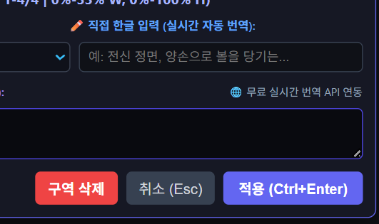
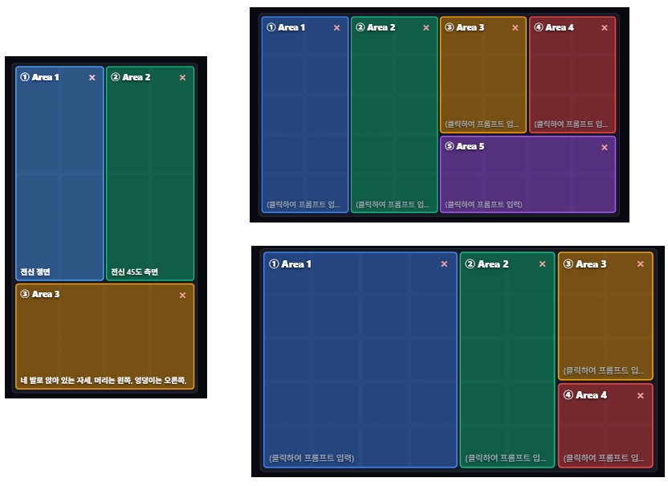

# 📐 ComfyUI Visual Grid Regional Prompt (비주얼 그리드 프롬프트)

<div align="center">


[](https://github.com/solokjd-eng/ComfyUI-Visual-Regional-Prompt/releases/latest)


### 🚀 [▶ 무설치 단독 실행형 웹 도구 (Visual_Grid_Prompt.html) 즉시 다운로드](https://github.com/solokjd-eng/ComfyUI-Visual-Regional-Prompt/releases/latest)

**ComfyUI 전용 커스텀 노드 및 웹 브라우저 단독 실행형 멀티 패널 공간 구도 프롬프트 생성기**  
(Krea 2, MiniMax, Flux, SD3, Midjourney, Imagen 3, ChatGPT, Gemini 최적화)

[한국어 설명](#-주요-기능) | [English Overview](#-english-overview)

</div>

---

## 🌟 노드 및 웹 도구 전체 화면 (Overview)


---

## 📸 스크린샷 및 사용 가이드 (Visual Guide)

### 1. 마우스 클릭 & 드래그로 원하는 구역(Area) 생성
* 빈 격자 칸에서 **마우스 좌클릭 후 대각선으로 드래그하고 손을 놓으면**, 지정한 크기의 사각형 영역(Area)이 즉시 생성됩니다!


---

### 2. 🧍 실제 생성 비율 1:1 동적 벡터 실루엣 뷰어
* 전신(세로 96% 꽉 찬 마네킹), 얼굴 150% 매크로 초근접 줌인, 인물 바스트(85%), 착석/누운 자세 등 **실제 AI 생성 이미지와 완벽히 일치하는 네온 벡터 실루엣**이 캔버스에 실시간 투영됩니다.

---

### 3. ⭐ 나만의 커스텀 프리셋 시스템 (Custom Presets Drawer)
* 자주 사용하는 포즈, 의상, 캐릭터 스타일을 **원클릭으로 등록(`💾 현재 입력 등록`)**하고, **접이식 아코디언 서랍**에서 편리하게 관리할 수 있습니다.
* **마우스 드래그 앤 드롭(Drag & Drop)**으로 프리셋 순서를 자유롭게 변경할 수 있으며, `localStorage`에 자동 영구 보존됩니다.

---

### 4. 🎨 5대 프리미엄 아트 스타일 프리셋 (Art Styles)
* **📷 극실사 사진 (Photorealistic RAW)**: 50mm f/1.8 렌즈, 자연스러운 피부 텍스처, 소프트 데이라이트 스튜디오 조명.
* **✨ 반실사 (Semi-Realistic / 2.5D)**: 세련된 디지털 페인팅, 부드러운 음영 및 화려한 2.5D 비주얼.
* **🎨 2D 애니 / 웹툰 (Anime & Manga)**: 깔끔한 라인 아트, 선명한 셀 채색, 트렌디한 일본 애니메이션/웹툰 스타일.
* **📐 캐릭터 설정화 (Concept Art Sheet)**: 게임/애니메이션 공식 캐릭터 디자인 시트, 삼면도/턴어라운드 레퍼런스.
* **🎮 3D CG 캐릭터 (3D CGI / Unreal 5)**: 옥테인 렌더링, 언리얼 엔진 5 시네마틱 3D 모델링.

---

### 5. 직접 한글 입력 & 실시간 자동 영문 번역
* **직접 한글로 원하는 프롬프트를 자유롭게 입력한 후 [적용 (Ctrl+Enter)]을 누르면**, 구글 실시간 번역 API 및 AI 최적화 사전으로 자동 영문 번역되어 최종 프롬프트에 실시간 반영됩니다.



---

### 6. 가로/세로 자유로운 멀티 패널 레이아웃 구성
* **세로(9:16), 가로(16:9), 정방형(1:1)** 등 원하는 비율과 칸 수에 맞춰 다채로운 분할 구도를 자유자재로 구성할 수 있습니다.
* 캐릭터 전신 샷 + 다각도 얼굴 클로즈업 + 상반신 포즈 등 **캐릭터 디자인 시트(Model Sheet)** 구성에 최적화되어 있습니다.



---

## ✨ 핵심 기능 요약 (Key Features)

1. **🌐 무설치 단독 실행형 HTML 도구 (`Visual_Grid_Prompt.html`) 제공**:
   * ComfyUI 설치 없이도 크롬, 엣지, 웨일, 모바일 브라우저에서 더블클릭 즉시 실행 가능.
2. **📐 반응형 뷰포트 & 화면 확대(Zoom 100%/80%/50%) 100% 자동 유지**:
   * 브라우저 확대 배율이나 창 크기에 관계없이 종횡비와 여백을 유연하게 자동 계산.
3. **🧍 1:1 완벽 일치 동적 벡터 실루엣 엔진**:
   * 칸 크기와 포즈에 최적화된 마네킹/뷰파인더/포트레이트 실루엣 실시간 오버레이.
4. **⭐ 커스텀 프리셋 & 마우스 드래그 앤 드롭 순서 변경**:
   * 접이식 아코디언 서랍, 원클릭 입력 등록, 순서 변경, 수정, 삭제 지원.
5. **👤 캐릭터 프로필 & 다중 저장 히스토리**:
   * 마우스로 모서리를 끌어 늘릴 수 있는 한글/영문 텍스트 박스 및 즐겨찾기 프로필 관리.
6. **🚫 텍스트 아티팩트 방지 (Natural Spatial Output)**:
   * 이미지 내에 숫자나 글자가 새겨지는 문제를 방지하기 위해 자연스러운 영어 공간 서술 및 네거티브 프롬프트 자동 조합.

---

## 📂 기본 제공 예제 워크플로우 (Example Workflow)

저장소의 [`workflows/visual_grid_prompt_workflow.json`](workflows/visual_grid_prompt_workflow.json) 파일을 ComfyUI 화면으로 **드래그 & 드롭**하시면 곧바로 완성된 캐릭터 시트 프롬프트 워크플로우를 테스트하실 수 있습니다!

---

## 🚀 설치 및 실행 방법 (Installation & Usage)

### 방법 1: 무설치 단독 웹 도구 사용 (추천 ⭐)
1. [`Visual_Grid_Prompt.html`](Visual_Grid_Prompt.html) 파일을 다운로드합니다.
2. 더블클릭하여 크롬/엣지 브라우저에서 즉시 실행합니다. (설치 불필요, 오프라인 사용 가능)

### 방법 2: ComfyUI 커스텀 노드 설치 (Git Clone)
ComfyUI의 `custom_nodes` 디렉토리에서 아래 명령어를 실행합니다:
```bash
cd ComfyUI/custom_nodes
git clone https://github.com/solokjd-eng/ComfyUI-Visual-Regional-Prompt.git
```

### 방법 3: ComfyUI Manager
1. ComfyUI Manager에서 **`Visual Grid Regional Prompt`** 검색 후 설치합니다.
2. ComfyUI를 재시작하고 웹 브라우저에서 **`Ctrl + Shift + R`**(강력 새로고침)을 실행합니다.

---

## 📄 라이선스 (License)
MIT License
